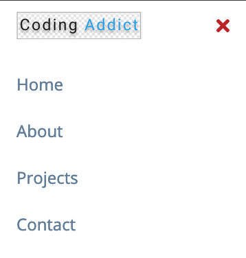
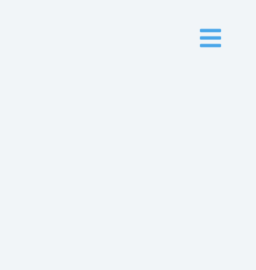

# Sidebar

> This is the project 5 of 15 from the course created by [John Smilga](https://www.johnsmilga.com) and also avaible on [you tube](https://www.youtube.com/watch?v=c5SIG7Ie0dM&list=PLnHJACx3NwAey1IiiYmxFbXxieMYqnBKF). **Sidebar** is the implementation of the toggle button option that when clicked appears and disappears the sidebar.




## Built With

- HTML
- CSS
- VSCode
- Vanilla JavaScript

## Getting Started

### Prerequisites

- Any Brownser

To get started open the directory where you will save this repo by typing on your terminal:

```
$ cd <directory>
```

- Clone the repo typing:

```
$ git clone git@github.com:brugobi/project_5_of_15-Sidebar.git

```

### Usage

- open the file *index.html* in any Brownser

## Author

👤 **Bruna Gobi**

- Github: [@brugobi](https://github.com/brugobi)
- Twitter: [@BrunaGobi2](https://twitter.com/BrunaGobi2)
- Linkedin: [bruna-gobi](https://www.linkedin.com/in/bruna-gobi/)

## 🤝 Contributing

Contributions, issues and feature requests are welcome!

## Show your support

Give a ⭐️ if you like this project!
Feel free to check the [issues page](issues/).

## Acknowledgments

- This is one project taken from the course created by [John Smilga](https://www.johnsmilga.com). Check out his YouTube channel [Coding Addict](https://www.youtube.com/codingaddict). Big cheers to the amazing creator.
